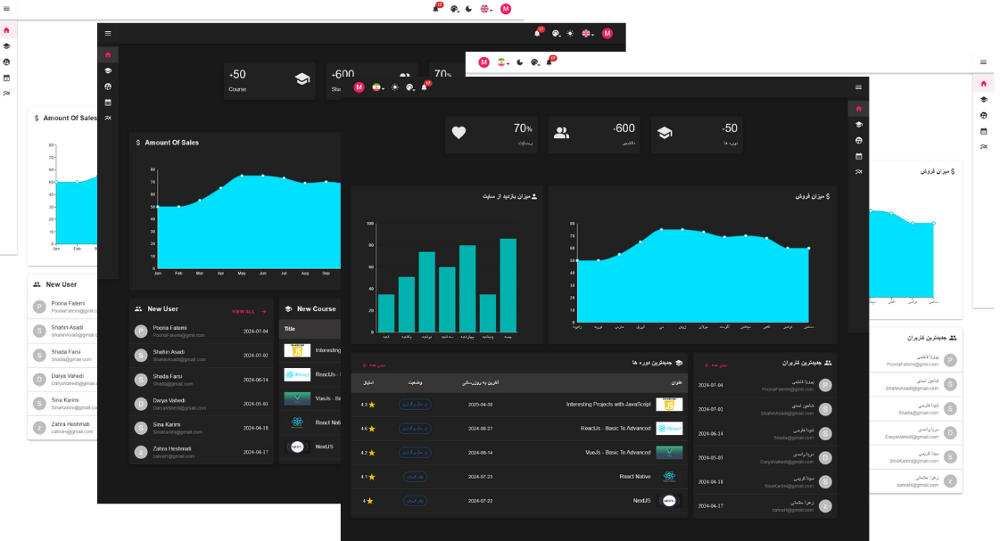
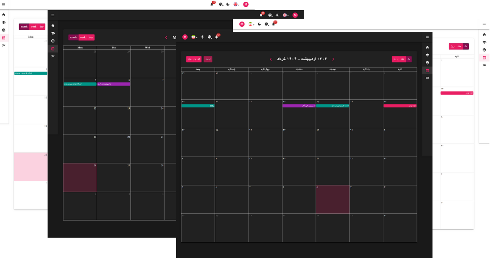

## 📊 Admin Dashboard | پنل مدیریت

## 📝 Description | توضیحات

A responsive, multilingual admin dashboard with light and dark themes.
- Includes a dynamic calendar for managing events
- Features a course management page with full CRUD operations

---

داشبورد مدیریتی رسپانسیو، دوزبانه، با قابلیت تغییر تم به حالت روشن و تاریک.  
- دارای تقویم برای مدیریت رویدادها
- دارای صفحه مدیریت دوره‌ها با قابلیت های کامل افزودن، ویرایش و حذف و مشاهده اطلاعات
## 📸 Screenshots

### 🖥️ Desktop Version | نسخه دسکتاپ  

### 🖥️ Dashboard  


### 📅 Calendar  


### 📚 Course Management  


### 📱 Mobile Version | نسخه موبایل  


## 🔗 Live Demo | نسخه آنلاین
👉 [admin-dashboard-alpha-five-14.vercel.app](https://admin-dashboard-alpha-five-14.vercel.app)

## 🚀 Tech Stack | تکنولوژی‌ها
- React
- MUI
- i18next
- Supabase
- FullCalendar
- Lodash
- React Router DOM
- React Hook Form
- React Toastify
- Context API

## ⚙️ Features | امکانات
- ✅ Light / Dark Theme toggle  
- ✅ Multilingual (English & فارسی)  
- ✅ FullCalendar for event management  
- ✅ CRUD operations on calendar & courses  
- ✅ Responsive layout  
- ✅ Toast notifications  
- ✅ Form validation with `react-hook-form`  
- ✅ Context management with `Context API`

---

- ✅ تغییر تم تاریک و روشن  
- ✅ دوزبانه (انگلیسی و فارسی)  
- ✅ تقویم برای مدیریت رویدادها  
- ✅ افزودن، ویرایش و حذف در رویدادها و دوره‌ها  
- ✅ طراحی رسپانسیو  
- ✅ نوتیفیکیشن با Toast  
- ✅ اعتبارسنجی فرم با React Hook Form  
- ✅ مدیریت وضعیت با Context API
## 📦 Installation | نصب و اجرا

```bash
git clone https://github.com/mahya-rastegarii/admin-dashboard.git
cd admin-dashboard
npm install
npm run dev

```

## 🎯 What I Learned | نکاتی که یاد گرفتم  

- Worked with MUI
- Implemented multilingual support using i18next
- Connected to Supabase and performed full CRUD operations
- Managed and validated forms using React Hook Form
- Integrated FullCalendar for interactive calendar views
- Used useContext for global state management

---

- کار با کتابخانه MUI 
- پیاده‌سازی چندزبانگی با i18next
- ارتباط با Supabase و عملیات CRUD
- مدیریت فرم‌ها با React Hook Form
- استفاده از FullCalendar برای ساخت تقویم
- استفاده از useContext برای مدیریت حالت‌ها


  
## 🙋‍♀️ Contact Me | ارتباط با من  
📧 [Email](mahya.rastegari@gmail.com)  
💼 [LinkedIn](https://www.linkedin.com/in/mahya-rastegarii)


<p align="center">       </p> 
